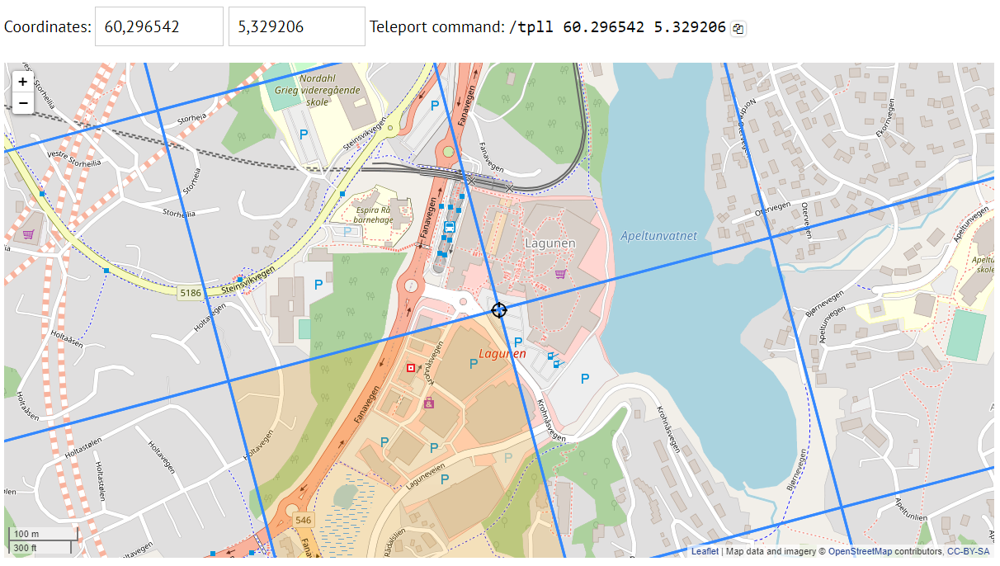
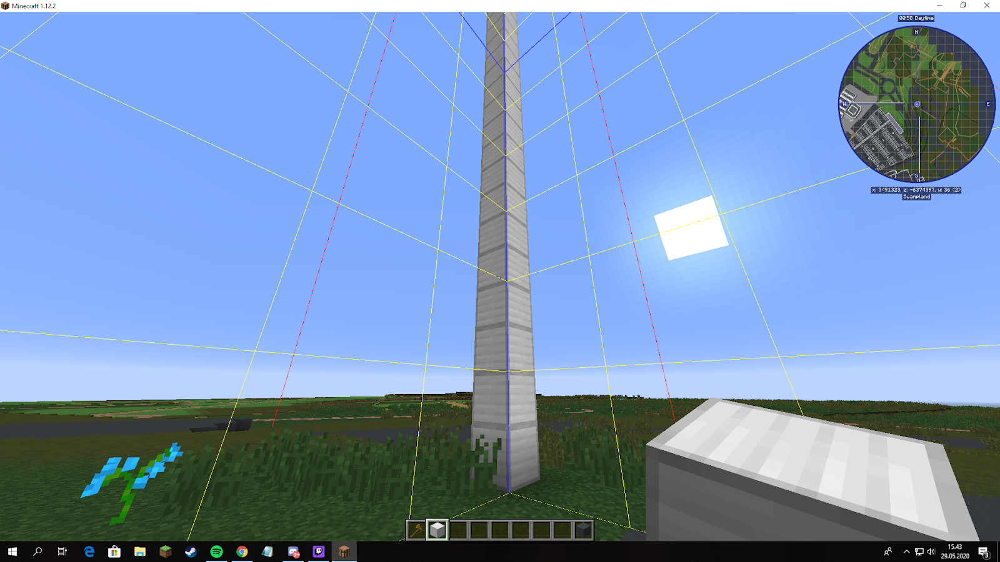
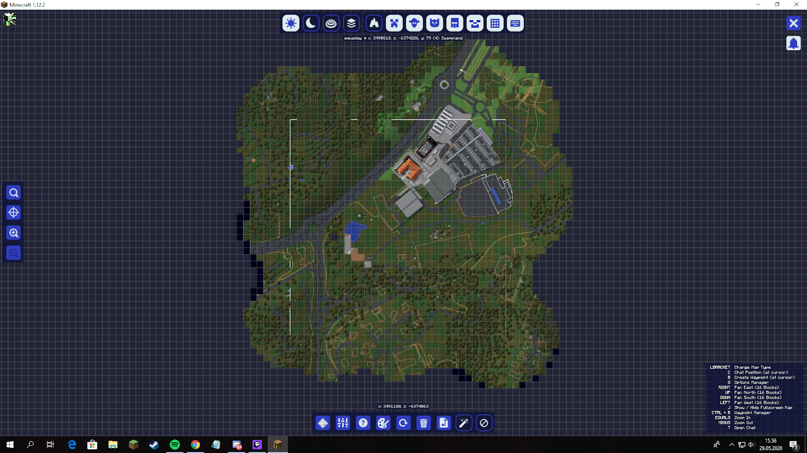

Knowing the exact borders of your plot is important as the submission system only submits your exact plot. Anything that is built outside your plot borders will not be transferred into the final world.

Unfortunately, an integrated plot marker system is not included in the modpack yet.
Firstly you have to find the corners of your plot and then mark the borders between the corners outside of your plot.
There are 2 ways to find  the corners

## Method 1 

Go to the [`website`](https://buildtheearth.net) and log into your “MyBuildTheEarth” account.
Open the region you want to find the borders to.

The X and Z coordinates given here are the Minecraft coordinates of the 4 corners of your plot.

In my case the corners could be found at:

<kbd>/tp [username] 4520448 [y-coordinate] 970752</kbd>
 
<kbd>/tp [username] 4520448 [y-coordinate] 971263</kbd>
 
<kbd>/tp [username] 4520959 [y-coordinate] 970752</kbd>
 
<kbd>/tp [username] 4520959 [y-coordinate] 971263</kbd>

Choose a sensible y-coordinate (it will be in meters above sea level)

## Method 2 

There will be a faster version of this being released by the development team, but for now, this is what we have.

1. Log onto the website, and find your claim on the [`map`](https://buildtheearth.net/map)
2. Move the center of the map to one of the corners, and use the <kbd>/tpll</kbd> command above the map.

**After you have found the corners of your plot:**

3. When you have teleported to your corner location, you can do <kbd>[F3] + [G]</kbd>. This will bring up the chunk borders
4. I am now standing on the inside of the claim, and then I build a pillar about 20 blocks tall on the corner <u>outside of the claim</u>, like this. If you place it on the inside, it will be in the world file when you upload it, and we do not want that

1. Then you can repeat step 2 to 4 until you have done all the corners. When that is completed, you can use WorldEdit with the <kbd>//line [Block-id]</kbd> command, to create a line from each corner. This will create a line of blocks outside of your claim, so you know to stay inside the borders.

   
